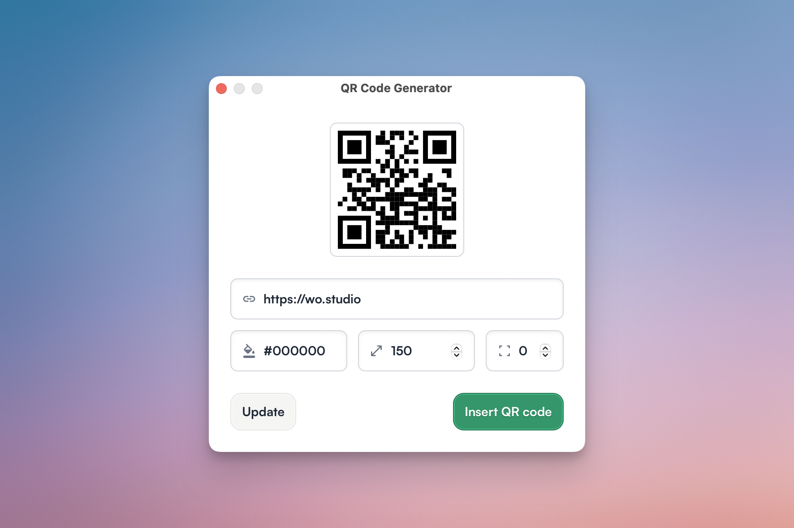

# QR Code Generator Sketch Plugin

Generate SVG QR codes from within Sketch. Utilising [qr-code-styling](https://github.com/kozakdenys/qr-code-styling) for QR creation.



### Options

| Input      | Description                                                   |
| ---------- | ------------------------------------------------------------- |
| Preview    | This is just for the color, and testing the QR.               |
| Url        | Enter the url you want the users to visit.                    |
| Color      | Hex code for the color of the QR.                             |
| Dimensions | Height and width of the QR.                                   |
| Padding    | Padding added to the SVG (this is taken from the dimensions.) |

### Todo

- [x] Initial release.
- [ ] Insert on selected frame.
- [ ] Save settings.
- [ ] Space for logo.
- [ ] Custom styles.

## Development

### Setup
```bash
npm install
```

### Development Workflow

1. **Start Svelte dev server**
   ```bash
   npm run dev:ui
   ```
   This starts Vite at http://localhost:5173 with hot reload

2. **Build and link plugin**
   ```bash
   npm run build:plugin
   npm run link
   ```

3. **Open Sketch and test**
   - Plugin loads UI from localhost:5173
   - Edit Svelte files and see changes instantly
   - No rebuild needed for UI changes!

### Production Build

```bash
npm run build
```

This will:
1. Build Svelte to a single HTML file
2. Build the Sketch plugin with the bundled UI
3. Output: `plugin/sketch-qr.sketchplugin`

### Scripts

- `npm run dev:ui` - Start Svelte dev server
- `npm run build:ui` - Build Svelte to single HTML
- `npm run build:plugin` - Build Sketch plugin
- `npm run build` - Build everything
- `npm run link` - Link plugin to Sketch
- `npm run clean` - Clean all build artifacts

## Structure

```
sketch-qr/
├── plugin/              # Sketch plugin
│   ├── src/
│   │   ├── main.js     # Plugin entry (loads webview)
│   │   └── manifest.json
│   └── package.json
├── ui/                  # Svelte app
│   ├── src/
│   │   ├── App.svelte  # Main component
│   │   ├── main.ts     # Entry point
│   │   └── app.css     # Tailwind styles
│   ├── index.html
│   ├── vite.config.ts
│   └── package.json
└── package.json         # Root workspace config
```

## Tech Stack

- **Sketch Plugin**: skpm
- **UI Framework**: Svelte 4
- **Build Tool**: Vite
- **Styling**: Tailwind CSS v3
- **Language**: TypeScript

## License

MIT © workingon.studio
